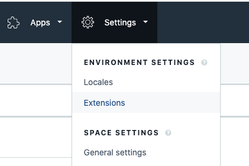
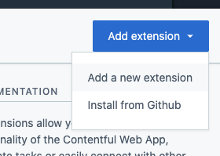
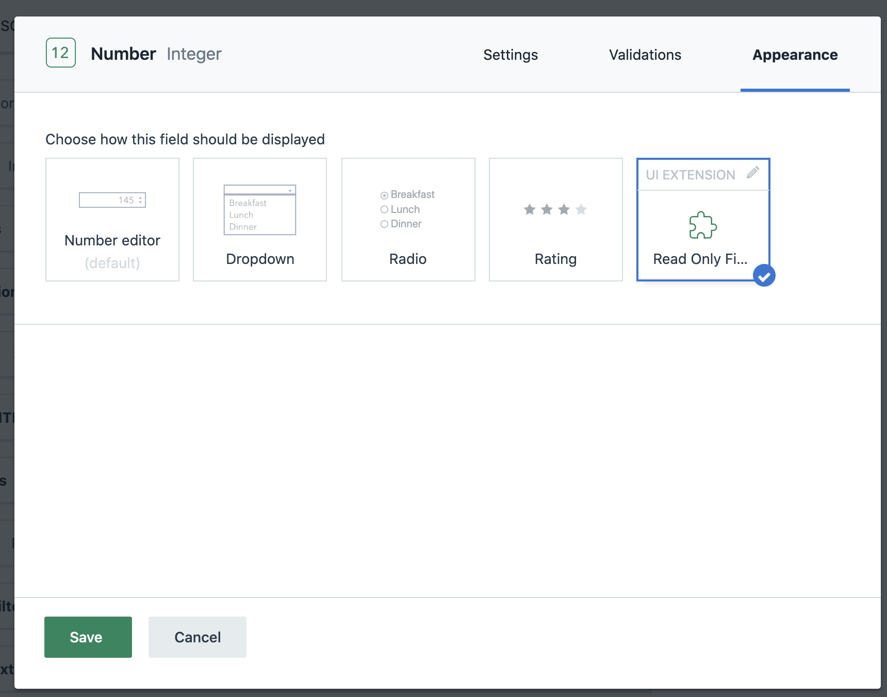

# Contentful Read Only Field

The index.html file in this repo contains minimal code to add an extension to a space in Contentful that will give users the ability to configure cerain fields to be read only.

### To add this extension to a space:

1. Go to Settings -> Extensions
   
2. Go to Add extension -> Add a new extension
   
3. Name the extension and configure it for the field types that you'd like to be able to apply this extension to. Make sure you have "Hosted by Contentful (srcdoc)" selected for "Hosting" and then paste the html from `index.html` in this repo in the "Code" field.

### To Apply this extension to a field:

1. Go to the "Content Model" that owns the field you would like to make read only.
2. Go to the "Settings" for that field.
3. Under the "Appearance" tab within the field settings, select "Read Only" (or whatever name you chose when adding the extension)  and click save. Note - if you do not see the extension as an option here, you may have not selected this field type when the extension was added to this space.
